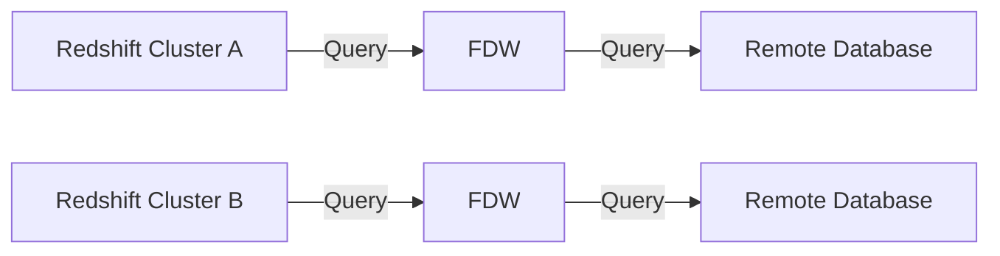

## [[RDS_Instance_Types|1. Advanced Architecture]]

[[redshift]] Federated Query enables querying data across multiple [[redshift]] clusters or SQL-compatible databases (such as Amazon [[Master/Git_hub_notes/AWS-SAP-C02-Notes-main/README|RDS]] or [[aurora]]) using a single SQL query. The service uses the familiar PostgreSQL syntax and works by creating a logical schema that maps to one or more external databases.

Internally, [[redshift]] Federated Query leverages the PostgreSQL Foreign Data Wrapper (FDW) functionality to enable cross-database queries. This mechanism allows [[redshift]] to issue distributed queries against remote tables as if they were local tables. The following diagram illustrates this architecture:



When it comes to [[RDS_Instance_Types|global scale considerations]], [[redshift]] Federated Query supports cross-Region connections between [[redshift]] clusters using [[Master/Git_hub_notes/AWS-SAP-C02-Notes-main/README|AWS Direct Connect]] or [[AWS_SA_PRO_Obsidian_Notes/Master/VPN|VPN]]. However, keep in mind that network latency can impact performance. To mitigate this issue, you can create copies of your data in multiple regions and perform regional query federation instead.

## [[RDS_Instance_Types|2. Comparison & Anti-Patterns]]

| Service | Use Case |
| --- | --- |
| [[redshift]] Federated Query | Multi-account data warehousing, centralized reporting, and analytics. |
| [[redshift]] Spectrum | Query data directly from [[Srinivas_Notes/S3|S3]] without loading into [[redshift]]. |
| [[glue|AWS Glue]] | Data integration, catalog management, and ETL tasks. |

Anti-patterns include:

- Performing real-time transactional workloads over the federated connection
- Using [[redshift]] Federated Query as a replacement for proper data modeling and normalization practices

## [[RDS_Instance_Types|3. Security & Governance]]

To implement complex [[Master/Git_hub_notes/AWS-SAP-C02-Notes-main/README|IAM]] [[policies]], you can leverage [[Master/Git_hub_notes/AWS-SAP-C02-Notes-main/README|IAM]] roles, permissions, and JSON [[policies]] similar to the example below:

```json
{
    "Version": "2012-10-17",
    "Statement": [
        {
            "Effect": "Allow",
            "Action": [
                "redshift:GetClusterCredentials"
            ],
            "Resource": [
                "*"
            ]
        },
        {
            "Effect": "Allow",
            "Action": [
                "redshift:ExecuteStatement"
            ],
            "Resource": [
                "*
            ],
            "Condition": {
                "StringEquals": {
                    "aws:SourceVpc": "<YOUR_VPC_ID>"
                }
            }
        }
    ]
}
```

Cross-account access is possible through [[Master/Git_hub_notes/AWS-SAP-C02-Notes-main/README|IAM]] roles and resource-based [[policies]]. For instance, you may grant access to a specific [[redshift]] cluster by attaching an [[Master/Git_hub_notes/AWS-SAP-C02-Notes-main/README|IAM]] policy like this:

```json
{
    "Effect": "Allow",
    "Principal": {
        "AWS": "arn:aws:iam::<ACCOUNT_NUMBER>:role/<ROLE_NAME>"
    },
    "Action": [
        "redshift:GetClusterCredentials",
        "redshift:DescribeClusters",
        "redshift:ExecuteStatement"
    ],
    "Resource": "arn:aws:redshift:<REGION>:<ACCOUNT_NUMBER>:cluster:<CLUSTER_NAME>",
    "Condition": {
        "StringEquals": {
            "aws:SourceVpc": "<YOUR_VPC_ID>"
        }
    }
}
```

Organization Service Control [[policies]] (SCPs) can be applied at the organization level to enforce restrictions on [[redshift]] Federated Query usage.

## [[RDS_Instance_Types|4. Performance & Reliability]]

[[redshift]] Federated Query has throttling limits based on the number of concurrent queries and the amount of data transferred per query. If these limits are exceeded, consider implementing exponential backoff strategies in your application code.

For high availability and [[Master/Git_hub_notes/AWS-SAP-C02-Notes-main/README|disaster recovery]] purposes, [[redshift]] Federated Query supports read replicas and snapshots. Implementing multi-region architectures requires careful consideration of network latencies and potential data duplication.

## [[RDS_Instance_Types|5. Cost Optimization]]

Granular cost control is achieved through monitoring and managing the following:

- Number of active [[redshift]] clusters
- Concurrent queries and their duration
- Data transfer costs between accounts and regions

Calculating the total cost involves summing up storage, compute, and data transfer costs:

Total Cost = Storage Cost + Compute Cost + Data Transfer Cost

## [[RDS_Instance_Types|6. Professional Exam Scenarios]]

### Scenario 1

Suppose you need to implement a multi-account data warehouse solution with two [[redshift]] clusters (A and B) in different accounts. How would you set up [[redshift]] Federated Query for this scenario?

Correct Answer #1:
Create a foreign table in [[redshift]] cluster A that references the remote database in [[redshift]] cluster B. Grant appropriate permissions to [[redshift]] cluster A's [[Master/Git_hub_notes/AWS-SAP-C02-Notes-main/README|IAM]] role.

Correct Answer #2:
Implement a cross-account [[Master/Git_hub_notes/AWS-SAP-C02-Notes-main/README|IAM]] role in both accounts to allow [[redshift]] cluster A's [[Master/Git_hub_notes/AWS-SAP-C02-Notes-main/README|IAM]] role to access [[redshift]] cluster B.

Incorrect Answer:
Configure a [[AWS_SA_PRO_Obsidian_Notes/Master/VPC|VPC]] peering connection between the two VPCs since [[redshift]] Federated Query does not require it.

### Scenario 2

You have a large dataset stored in [[AWS_SA_PRO_Obsidian_Notes/Master/S3|S3]] and want to perform analytics using [[redshift]] Federated Query. What is the best way to achieve this goal?

Correct Answer:
Use [[redshift]] Spectrum to query data directly from [[AWS_SA_PRO_Obsidian_Notes/Master/S3|S3]] without loading it into [[redshift]].

Incorrect Answers:

- Create a new [[redshift]] cluster and load all the data from [[AWS_SA_PRO_Obsidian_Notes/Master/S3|S3]] into that cluster.
- Implement [[redshift]] Federated Query to connect the [[redshift]] cluster to the [[AWS_SA_PRO_Obsidian_Notes/Master/S3|S3]] bucket.