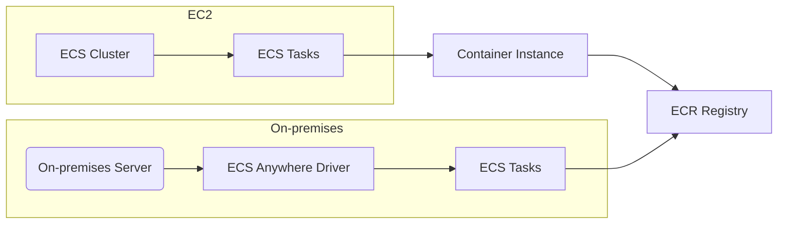

Advanced Architecture
---------------------

[[ecs]] Anywhere is a new capability of Amazon [[Master/Git_hub_notes/AWS-SAP-C02-Notes-main/README|Elastic Container Service (ECS)]] that allows customers to run [[ecs]] tasks and services on their own servers, in addition to running them on AWS infrastructure. This is achieved by using the [[ecs]] Anywhere server driver, which can be installed on any machine that meets the system requirements.

The following diagram shows an advanced architecture that uses [[ecs]] Anywhere:

In this architecture, there are two [[ecs]] clusters: one that runs on AWS infrastructure ([[ec2]] instances) and another that runs on the customer's own servers (on-premises servers). Both clusters share the same ECR registry, which stores the container images used by the [[ecs]] tasks. The on-premises server has the [[ecs]] Anywhere driver installed, which enables it to connect to the [[ecs]] cluster and run [[ecs]] tasks.

When creating an [[ecs]] task definition, you can specify whether it should be eligible to run on [[ecs]] Anywhere-enabled clusters. If the task definition is marked as "aws::[[ecs]]:taskDefinition/requiresAttributes", then it can only run on [[ecs]] Anywhere-enabled clusters.

Comparison & Anti-Patterns
---------------------------

Here is a comparison table between [[ecs]] Anywhere and other services:

| Service | Pros | Cons |
| --- | --- | --- |
| [[ecs]] Anywhere | Allows you to run [[ecs]] tasks on your own servers. | Requires additional configuration and management. |
| [[eks]] Anywhere | Similar to [[ecs]] Anywhere but for Kubernetes. | Requires additional configuration and management. |
| [[Fargate]] | Simplifies deployment and scaling of containers. | Limited control over underlying infrastructure. |
| Batch | Ideal for running batch jobs and workloads. | Not suitable for long-running applications or services. |

Common anti-patterns when using [[ecs]] Anywhere include:

* Running [[ecs]] Anywhere on unsupported operating systems or hardware.
* Not properly configuring the [[ecs]] Anywhere driver.
* Using [[ecs]] Anywhere for workloads that would be better suited for other services (e.g., [[Fargate]] or Batch).

[[appsync|Security]] & Governance
----------------------

To ensure proper [[appsync|security]] and governance when using [[ecs]] Anywhere, you need to implement complex [[Master/Git_hub_notes/AWS-SAP-C02-Notes-main/README|IAM]] [[policies]], cross-account access, and organization service control [[policies]] (SCPs). Here are some JSON snippets that demonstrate these concepts:

### [[Master/Git_hub_notes/AWS-SAP-C02-Notes-main/README|IAM]] Policy

This [[Master/Git_hub_notes/AWS-SAP-C02-Notes-main/README|IAM]] policy grants permission to create [[ecs]] tasks on a specific [[ecs]] Anywhere-enabled cluster:

```json
{
  "Version": "2012-10-17",
  "Statement": [
    {
      "Effect": "Allow",
      "Action": [
        "ecs:RunTask"
      ],
      "Resource": [
        "arn:aws:ecs:us-west-2:123456789012:task-definition/my-task:foo:*",
        "arn:aws:ecs:us-west-2:123456789012:task-definition/my-task:bar:*",
        "arn:aws:ecs:us-west-2:123456789012:task-definition/my-task:baz:*"
      ],
      "Condition": {
        "StringEquals": {
          "ecs:cluster": "my-ecs-anywhere-enabled-cluster"
        }
      }
    }
  ]
}
```

### Cross-Account Access

To allow cross-account access between an [[ecs]] Anywhere-enabled cluster and an ECR registry, you need to create a role that assumes the necessary permissions:

```json
{
  "Version": "2012-10-17",
  "Statement": [
    {
      "Effect": "Allow",
      "Principal": {
        "AWS": "arn:aws:iam::123456789012:root"
      },
      "Action": "sts:AssumeRole",
      "Condition": {
        "Bool": {
          "aws:MultiFactorAuthPresent": true
        }
      }
    }
  ]
}
```

### Organization SCPs

To enforce organizational [[policies]] across all accounts in your [[AWS Organization]], you can use service control [[policies]] (SCPs):

```json
{
  "Version": "2012-10-17",
  "Statement": [
    {
      "Effect": "Deny",
      "Action": [
        "ecs:RegisterTaskDefinition"
      ],
      "Resource": [
        "*"
      ],
      "Condition": {
        "StringNotEqualsIgnoreCase": {
          "ecs:resourceType": "TASK_DEFINITION"
        }
      }
    }
  ]
}
```

Performance & Reliability
--------------------------

When using [[ecs]] Anywhere, you must consider throttling limits, exponential backoff strategies, and high availability (HA)/disaster recovery ([[dr]]) patterns.

Throttling limits for [[ecs]] Anywhere depend on the number of tasks that can be concurrently executed. To avoid hitting these limits, you can implement exponential backoff strategies that retry failed requests after a specified amount of time.

For HA/DR patterns, you can use multiple [[ecs]] Anywhere-enabled clusters across different regions or availability zones. By doing so, if one cluster goes down, the other clusters can continue to run the [[ecs]] tasks.

[[Master/Git_hub_notes/AWS-SAP-C02-Notes-main/README|Cost Optimization]]
------------------

Granular cost controls for [[ecs]] Anywhere can be implemented by using tags and resource groups. For example, you can tag your [[ecs]] tasks and then set up a [[billing]] report that breaks down costs based on those tags.

Here is an example of how to tag an [[ecs]] task definition:

```json
{
  "containerDefinitions": [
    {
      "name": "my-container",
      "image": "my-image",
      "memory": 256,
      "cpu": 128,
      "essential": true,
      "tags": [
        {
          "key": "costCenter",
          "value": "CC-1234"
        }
      ]
    }
  ]
}
```

Professional Exam Scenarios
----------------------------

Scenario 1:

You are designing a hybrid cloud solution that involves running [[ecs]] tasks both on AWS infrastructure and on-premises servers. Which [[ecs]] feature allows you to achieve this?

Correct answer: [[ecs]] Anywhere

Incorrect answer: [[Fargate]]
Justification: [[Fargate]] does not support running tasks on on-premises servers.

Scenario 2:

Your company has strict compliance requirements that mandate certain workloads to run on-premises. You want to use [[ecs]] to manage these workloads. How do you ensure that these workloads are not accidentally deployed to AWS infrastructure?

Correct answer: Create an [[ecs]] task definition that requires attributes compatible with [[ecs]] Anywhere-enabled clusters.

Incorrect answer: Implement network ACLs and [[appsync|security]] groups to restrict access to on-premises resources.
Justification: While this approach may prevent accidental access to on-premises resources, it does not ensure that [[ecs]] tasks are deployed to the correct environment.