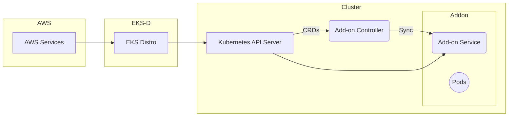

**Advanced Architecture: [[eks]] Add-ons**

[[eks]] Add-ons simplify the deployment and management of essential cluster services and applications. They are built as Kubernetes [[cloudformation|Custom Resources]] and can be managed using Kubernetes API tools like `kubectl`. Amazon [[eks]] Distro (EKS-D) is used to provide these add-ons, ensuring compatibility across various Kubernetes versions.

Internally, an [[eks]] Add-on controller manages the lifecycle of these resources. The controller continuously syncs the actual state of the add-ons with the desired state specified in the Custom Resource. This mechanism allows for seamless updates, scaling, and deletion of the add-ons.

[[RDS_Instance_Types|Global scale considerations]] include managing multiple [[eks]] clusters in different regions or even AWS accounts. To address this challenge, you can deploy Add-ons at the organizational level by leveraging [[organizations|AWS Organizations]] and cross-account Kubernetes RBAC. This approach enables consistent configuration and maintenance across your entire organization.

The following Mermaid syntax diagram illustrates how [[eks]] Add-ons interact with other components in an [[eks]] cluster:

**Comparison & Anti-Patterns**

Here's a comparison table between [[eks]] Add-ons and alternative solutions like Helm charts and Kustomize:

| Factor                     | [[eks]] Add-ons                   | Helm Charts           | Kustomize              |
|-----------------------------|-------------------------------|-----------------------|-------------------------|
| Configuration               | [[cloudformation|Custom Resources]]             | Chart files           | Patches and overlays    |
| Versioning                  | CRD versioning                | Chart versioning      | GitOps workflows       |
| Namespace isolation          | Yes                           | Requires manual steps | Requires manual steps   |
| Multi-account support       | Native through AWS Orgs       | Not natively supported| Not natively supported|

An anti-pattern for [[eks]] Add-ons would be attempting to manage them manually without using the provided controller or AWS App Mesh Vizualizer. Doing so could lead to inconsistent configurations and misaligned desired [[step-functions|states]].

**[[appsync|Security]] & Governance**

Complex [[Master/Git_hub_notes/AWS-SAP-C02-Notes-main/README|IAM]] [[policies]] for [[eks]] Add-ons involve granting permissions to specific roles for managing each add-on. An example JSON policy snippet follows:
```json
{
  "Version": "2012-10-17",
  "Statement": [
    {
      "Effect": "Allow",
      "Action": [
        "eks-anywhere:Describe*"
      ],
      "Resource": "*"
    },
    {
      "Effect": "Allow",
      "Action": [
        "eks:DescribeCluster",
        "eks:ListClusters",
        "eks:DescribeFargateProfile",
        "eks:ListUpdates",
        "eks:DescribeUpdate",
        "eks:ListTagsForResource"
      ],
      "Resource": "*"
    }
  ]
}
```
Cross-account access can be achieved using AWS [[sts]] AssumedRoleWithWebIdentity and configuring OIDC provider settings within the destination account. Additionally, applying Service Control [[policies]] (SCPs) at the [[AWS Organization]] level ensures consistent [[appsync|security]] [[policies]] across all member accounts.

**Performance & Reliability**

Throttling limits for [[eks]] Add-ons are primarily determined by the underlying AWS services that they utilize. For instance, if an Add-on relies on Amazon [[cloudwatch|CloudWatch Logs]], it will inherit the same throttling limits as [[cloudwatch|CloudWatch Logs]]. Implementing exponential backoff strategies when handling [[api-gateway|errors]] during Add-on operations helps ensure high availability and reliability.

Highly available and [[Master/Git_hub_notes/AWS-SAP-C02-Notes-main/README|disaster recovery]] (HA/DR) patterns should include deploying [[eks]] Add-ons across multiple Availability Zones (AZs) and regions based on their criticality. Using [[Master/Git_hub_notes/AWS-SAP-C02-Notes-main/README|AWS Backup]], you can create backup plans that protect [[eks]] resources, including Add-ons.

**[[Master/Git_hub_notes/AWS-SAP-C02-Notes-main/README|Cost Optimization]]**

Granular cost controls for [[eks]] Add-ons can be implemented by setting up [[billing]] alarms based on AWS [[billing|Cost Explorer]] data and utilizing [[billing|AWS Budgets]]. Calculating costs associated with [[eks]] Add-ons involves understanding the pricing models of the underlying AWS services and estimating the required compute resources.

**Professional Exam Scenarios**

Scenario 1:
You need to implement a centralized [[vpc-flow-logs|logging]] solution for multiple [[eks]] clusters distributed across several AWS accounts. Which combination of tools and services would best suit this requirement?

Correct Answer: AWS [[cloudwatch|CloudWatch Logs]], AWS App Mesh Vizualizer, AWS Single Sign-On (SSO), [[organizations|AWS Organizations]]

Explanation: By implementing AWS [[cloudwatch|CloudWatch Logs]] as the centralized [[vpc-flow-logs|logging]] solution, you can collect logs from multiple [[eks]] clusters and distribute them across different AWS accounts. Leveraging AWS App Mesh Vizualizer, you can visualize and monitor the traffic flow between microservices. To enable centralized management, connect AWS SSO to your [[organizations|AWS Organizations]] setup, allowing users to sign in once and access all necessary AWS accounts.

Incorrect Answers:

* Using Helm charts instead of [[cloudwatch|CloudWatch Logs]] would not allow for centralized [[vpc-flow-logs|logging]] across multiple AWS accounts.
* Deploying [[eks]] Add-ons directly in each account without using [[organizations|AWS Organizations]] would result in poor governance and inconsistent configurations.

Scenario 2:
Your company has strict compliance requirements, and you must enforce specific [[appsync|security]] [[policies]] across all [[eks]] clusters. How would you achieve this while maintaining ease of management?

Correct Answer: Apply Service Control [[policies]] (SCPs) at the [[AWS Organization]] level.

Explanation: By applying SCPs at the [[organizations|AWS Organizations]] level, you can ensure that specific [[appsync|security]] [[policies]] are enforced consistently across all member accounts containing [[eks]] clusters. This method provides a single point of control for [[appsync|security]] [[policies]], making it easier to maintain and update them over time.

Incorrect Answers:

* Implementing individual [[Master/Git_hub_notes/AWS-SAP-C02-Notes-main/README|IAM]] [[policies]] within each account might result in inconsistencies and increased complexity.
* Managing [[appsync|security]] [[policies]] solely through [[eks]] Add-ons does not offer sufficient granularity or coverage for all aspects of the [[eks]] environment.